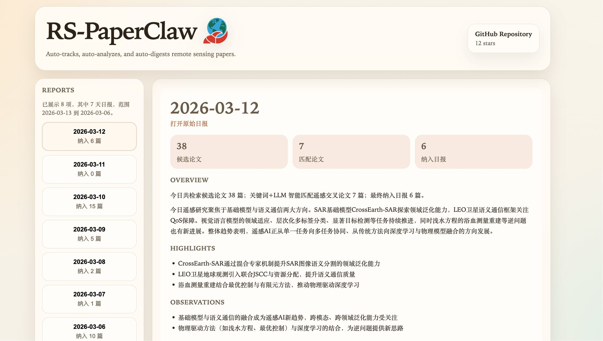
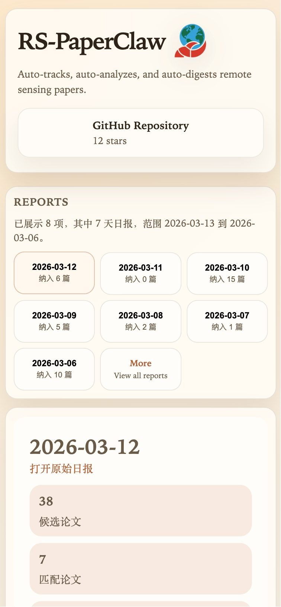

<div align="center">
  

# RS-PaperClaw🦞

### 遥感论文自动追踪与分析流水线

[](#)
[](#)
[](#)
[](https://thinson.github.io/RS-PaperClaw/)

**arXiv → 单篇报告 Issue → 每日汇总日报 → 可视化阅读页面**

English version: **[README_EN.md](./README_EN.md)**

</div>

---

## 🌐 在线阅读入口

- 项目主页（GitHub Pages）：**https://thinson.github.io/RS-PaperClaw/**
- 日报归档目录：**[daily_reports/](./daily_reports/README.md)**

## 🖼️ 界面预览

> 已做轻量压缩，兼顾清晰度与加载速度。

### 电脑端



### 移动端



---

## ✨ 项目做什么

RS-PaperClaw 每天自动完成：

- 🔎 拉取 arXiv 候选论文（遥感相关）
- 🧠 关键词 + LLM 二级筛选
- 📝 生成 / 更新单篇阅读报告（GitHub Issue）
- 🗞️ 生成当天日报（GitHub Issue）
- 🗂️ 同步日报到 `daily_reports/YYYYMM/YYYYMMDD.md`
- 📮 推送摘要到飞书

---

## 🎯 为什么以 Issue 为核心

- 🧭 **可追踪**：单论文单 Issue，历史与改动可回溯
- 🤝 **易协作**：评论即讨论，补充即沉淀
- ⚙️ **自动化友好**：增量流程可稳定更新同一条记录
- 🗂️ **归档闭环**：Issue 动态协作 + Markdown 静态留档

---

## 🧩 核心能力

| 模块 | 输出 |
|---|---|
| 单篇报告 | 基础信息、TL;DR、中文摘要、标签、前三页预览图、10问分析 |
| 日报生成 | 今日概况（含数量统计）、亮点、文章列表、观察 |
| 质量控制 | 过滤占位内容，保障结构完整与可读性 |
| 结果归档 | Issue + Markdown 双轨同步，便于追踪与回溯 |
| 可视化页面 | 最近日报浏览、移动端卡片视图、Issue 深读弹层 |

---

## 🗺️ 目录结构（main）

```text
RS-PaperClaw/
├── docs/                             # GitHub Pages 静态页面
│   ├── index.html
│   └── logo-220.png
├── daily_reports/                    # 日报归档（按年月）
│   ├── README.md
│   └── YYYYMM/YYYYMMDD.md
├── papers/previews/                  # 论文预览图（用于 Issue 展示）
├── skills/rs-paper-pipeline/         # 技能与脚本
│   ├── README.md
│   ├── SKILL.md
│   └── scripts/
│       ├── paper_processor.py
│       ├── daily_arxiv_cross_filter.py
│       ├── daily_digest_llm_upgrade.py
│       ├── run_rs_daily_workday.py
│       └── sync_daily_reports_to_repo.py
└── README_EN.md
```

---

## 🚀 快速开始

### 1) 环境准备

- Python 3.10+
- `pip install PyGithub`
- 系统工具：`poppler-utils`（`pdftoppm`、`pdftotext`）

### 2) 配置环境变量

```bash
export GITHUB_TOKEN="..."
export GITHUB_REPO="owner/repo"
export BAILIAN_API_KEY="..."
# 可选
export FEISHU_TARGET="user:xxx"
export LLM_MODEL="MiniMax-M2.5"
```

### 3) 运行当天流程

```bash
python3 skills/rs-paper-pipeline/scripts/run_rs_daily_workday.py
```

---

## ⏰ 定时任务（示例）

```cron
CRON_TZ=Asia/Shanghai
5 9 * * 1-5 /usr/bin/python3 /path/to/skills/rs-paper-pipeline/scripts/run_rs_daily_workday.py >> /path/to/logs/rs_daily_workday.log 2>&1
```

---

## 📎 备注

- 默认文档语言为中文；英文请见 [README_EN.md](./README_EN.md)
- 页面部署方式：`main` 分支 + `/docs`

---

## ⭐ Star History

[](https://star-history.com/#thinson/RS-PaperClaw&Date)
